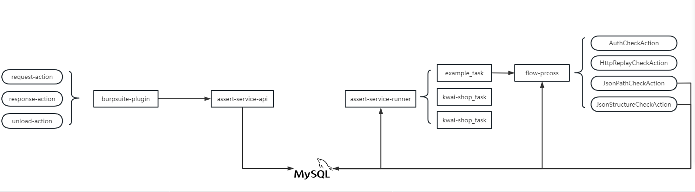

## security_flow_assert

企业内部对于代码/接口的改动发现、扫描及漏洞处理时间非常短，不管是基于git hook、AST、JaCoCo或各种精准测试能力在基于代码的基础上均可以做到快速识别，而从外部测试/白帽子角度仅能从黑盒角度判断是否存在接口迭代，从漏洞的角度看接口安全性与安全团队能力成熟度成正比，即新增接口安全测试覆盖度较高，那历史存量接口做迭代是否会100%覆盖？是否更容易出现漏洞？

为什么要造轮子？整体评估从流量采集到断言测试整体开发成本不高且迭代成本更低。需要的不只是一个自动化测试系统，而是一个更好用的、可以高度订制的自动化测试系统。

### 整体架构图

```
.
├── security-assert-plugin
│   ├── pom.xml
│   ├── README.md
│   ├── security-assert-plugin.iml
│   ├── src
│   └── target
└── security-assert-service
    ├── db
    ├── pom.xml
    ├── security-assert-service-api
    ├── security-assert-service-component
    └── security-assert-service-runner
```
整体分为三部分：
- 流量采集：目前仅实现burpsuite插件，通过```IExtensionStateListener、IProxyListener```监控获取request、response信息以及在插件关闭时发送状态消息；
- service-api：用于流量采集且经过自定义```request\response```过滤去重处理后存储到mysql中，request和response原子性通过burpsuite的```iInterceptedProxyMessage.getMessageReference()```来保证；
- server-runner：实现流量定期回放、流式处理assert的能力，支持在interface上做横向扩展，且对于不符合预期做mysql处理。todo:该部分没有存储完成状态机，后续可优化存储到clickhouse中；

### service-api关键信息
```security-assert-service/security-assert-service-component/src/main/java/com/kevinsa/security/service/service/collect```
```aidl
├── base
│   ├── FilterActionUnit.java
│   ├── FilterActionUnitTemplate.java
│   └── ProcessContext.java
├── BaseExecutor.java
└── filterAction
    ├── request
    └── response
```
在```base```中定义后于过滤处理的基本方法，```BaseExecutor```中定义入口函数；

```java
public interface FilterActionUnit<T> {

    @NotNull
    String getPattern(); // 定义正则，用于区分流量

    @NotNull
    String getBizMsg(); // 定义当前类的biz

    @NotNull
    boolean isEnable();

    ProcessContext<T> execute(ProcessContext<T> processContext); // context处理
}
```
### server-runner关键信息
#### 周期函数入口
```security-assert-service/security-assert-service-runner/src/main/java/com/kevinsa/security/service/runner/base/ScheduledBaseTask.java```
继承ApplicationRunner，在```run(ApplicationArguments args)```中做具体的任务实现逻辑。
```java
@Service
public interface ScheduledBaseTask extends ApplicationRunner {

    @NotNull
    String taskName();

    @NotNull
    String bizMsg();

    @NotNull
    Integer initialDelayHour();

    @NotNull
    Integer periodHour();

    Runnable exec();

}
```

#### 流式处理
```jetbrains://idea/navigate/reference?project=security-assert&fqn=com.kevinsa.security.service.service.assertCheck.AssertExecutorFactory```
中提供入口函数
```java
public class AssertExecutorFactory {

    public DefaultProcessContext createDefaultContext() {
        DefaultProcessContext context = new DefaultProcessContext();
        context.setBizId(DefaultFlowConfig.DEFAULT_ASSERT_EXECUTOR_FLOW);
        return context;
    }
}
```
流式处理模板构建方法可参考````security-assert-service/security-assert-service-component/src/main/java/com/kevinsa/security/service/service/assertCheck/flowConfig/DefaultFlowConfig.java```
```java
public class DefaultFlowConfig {

    @Resource
    private AssertProcessFlow processFlow;

    public static final String DEFAULT_ASSERT_EXECUTOR_FLOW = "default_assert_executor_flow";

    @PostConstruct
    public void processFlow() {
        Map<String, ProcessTemplate> templateConfig = processFlow.getTemplateConfig();
        templateConfig.put(DEFAULT_ASSERT_EXECUTOR_FLOW, defaultAssertExecutor());
        processFlow.setTemplateConfig(templateConfig);
    }

    @Bean
    public ProcessTemplate defaultAssertExecutor() {
        ProcessTemplate template = new ProcessTemplate();
        List<AssertStepAction> processConfig = Lists.newArrayList();

        processConfig.add(authCheckAction());
        processConfig.add(httpReplayCheckAction());
        processConfig.add(jsonPathCheckAction());

        processConfig.add(jsonStructureCheckAction());

        template.setProcessConfig(processConfig);
        return template;
    }

    @Bean
    AuthCheckAction authCheckAction() {return new AuthCheckAction();}

    @Bean
    HttpReplayCheckAction httpReplayCheckAction() {return new HttpReplayCheckAction();}

    @Bean
    JsonStructureCheckAction jsonStructureCheckAction() {return new JsonStructureCheckAction();}

    @Bean
    JsonPathCheckAction jsonPathCheckAction() {return new JsonPathCheckAction();}


}
```

### 支持assert类型
在```security-assert-service/security-assert-service-component/src/main/java/com/kevinsa/security/service/service/operator```中定义基本的运算符配合jsonPath做assert处理
```java
public enum OperatorTypeEnums {
    UNKNOWN("unknown", "未知操作类型"),
    EQU("EQU", "equal || =="),
    NEQ("NEQ", "not equal || !="),
    MT("MT", "more than || >"),
    LT("LT", "less than || <"),
    ;
}
```
#### 实例
```+----+-----------+--------------------+----------------------------------------+-----------------------------------------------------+------+--------+-------------+-------------+
   | id | business  | api_host           | api_path                               | data                                                | type | status | create_time | update_time |
   +----+-----------+--------------------+----------------------------------------+-----------------------------------------------------+------+--------+-------------+-------------+
   |  2 | kwai-shop | s.kwaixiaodian.com | /rest/app/tts/ks/seller/order/query/v2 | {"type": "EQU", "value": 1, "jsonPath": "$.result"} |    2 |      1 | 0           | 0           |
   +----+-----------+--------------------+----------------------------------------+-----------------------------------------------------+------+--------+-------------+-------------+
```
```{"type": "EQU", "value": 1, "jsonPath": "$.result"}```即说明对response做```$.result``` jsonPath解析后的value，做EUQ运算，即value.EUQ(1)

### example
以kwai-xiaodian为例子给出部分实现逻辑
#### 流量采集的FilterActionUnit
request过滤：```security-assert-service/security-assert-service-component/src/main/java/com/kevinsa/security/service/service/collect/filterAction/request/ReqDefaultFilterAction.java```
response过滤：```security-assert-service/security-assert-service-component/src/main/java/com/kevinsa/security/service/service/collect/filterAction/response/RespDefaultFilterAction.java```

#### 周期任务验证
- 周期任务： ```security-assert-service/security-assert-service-runner/src/main/java/com/kevinsa/security/service/runner/task/ExampleAssertTask.java```
- 处理模板：```security-assert-service/security-assert-service-component/src/main/java/com/kevinsa/security/service/service/assertCheck/flowConfig/DefaultFlowConfig.java```

#### assert_rule
```mysql
mysql> select * from assert_action_rule where type != 0;
+----+-----------+--------------------+----------------------------------------+-----------------------------------------------------+------+--------+-------------+-------------+
| id | business  | api_host           | api_path                               | data                                                | type | status | create_time | update_time |
+----+-----------+--------------------+----------------------------------------+-----------------------------------------------------+------+--------+-------------+-------------+
|  2 | kwai-shop | s.kwaixiaodian.com | /rest/app/tts/ks/seller/order/query/v2 | {"type": "EQU", "value": 1, "jsonPath": "$.result"} |    2 |      1 | 0           | 0           |
|  3 | kwai-shop | s.kwaixiaodian.com | /rest/app/tts/ks/seller/order/query/v2 | {"type": "MT", "value": 0, "jsonPath": "$.result"}  |    3 |      1 | 0           | 0           |
+----+-----------+--------------------+----------------------------------------+-----------------------------------------------------+------+--------+-------------+-------------+
2 rows in set (0.00 sec)
```
### feature
- burpsuite-puligin：目前插件不支持UI图形化，即流量收集的service地址硬编码；
- 状态机：目前mysql中仅存储原始流量信息、assert规则信息、assert规则结果信息，没有对流量重放、assert判断等状态机做存储，利于问题排查，规划做clickhouse存储并支持自定义状态机；